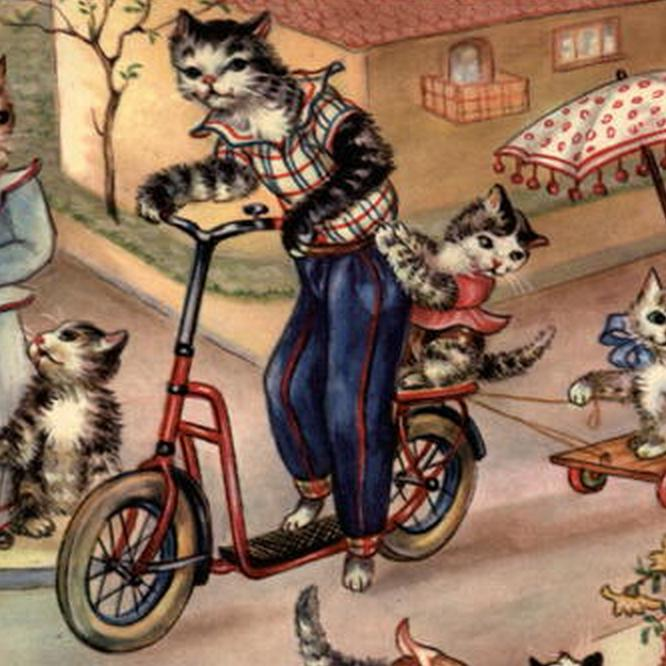

# Techniques and Layouts

There are a couple of common layouts that floats work really well for, let's explore them.

## Grids

```html
<html>
	<head>
		<link rel="stylesheet" type="text/css" href="reset.css" />
		<link rel="stylesheet" type="text/css" href="style.css" />
	</head>
	<body>
		<div id="gallery" class="clearfix">
			
			
			
			
			
			
			
			
			
			
			
			
			
			
			
			
			
			
		</div>
	</body>
</html>
```

```css
body {
	padding: 10px;
}
#gallery {
	border: 1px solid red;
	padding: 10px;
}
#gallery img {
	float:left;
	width: 200px;
	height: 200px;
	border: 1px solid black;
	margin: 10px;
}
.clearfix:after {
  content: "";
  display: table;
  clear: both;
}
```


### How Many Items in a Row

Without setting any parameters, there will be as many items in a grid row as the width of the entire window allows. If you were to resize your window, any items that don't fit in the row would simply drop down to the next one, creating more rows.

But let's say you only want four items per row. There are a couple of ways to do this.

#### Resize the Parent Element

You could simply resize the width of the `#gallery` element to the total width of four `img` elements:

```css
#gallery {
	border: 1px solid red;
	padding: 10px;
	width: 888px;
}
```


#### Using the Clear Property

You could also use the `clear` property to force floated items to drop down to the next line. In this case, we would have to alter our HTML a bit:

```html


```
Leaving the `#gallery` width unspecified, we can now simply add the `.new-row` class to our stylesheet:

```css
.new-row {
	clear: left;
}
```

This gives us a similar result:


## Badges

```html
<html>
	<head>
		<link rel="stylesheet" type="text/css" href="reset.css" />
		<link rel="stylesheet" type="text/css" href="style.css" />
	</head>
	<body>
		<div id="badge" class="clearfix">
			
			<h1>Tom Cuddles</h1>
			<h3>Professional Scooter-er</h3>
			<p>Interested in Full-Time Scooter Employment</p>
		</div>
	</body>
</html>
```

```css
body {
	padding: 10px;
}
#badge {
	border: 1px solid red;
	padding: 10px;
	width: 450px;
	height: 200px;
}
#badge img {
	float:left;
	width: 150px;
	height: 150px;
	border: 1px solid black;
	margin: 10px;
}
.clearfix:after {
  content: "";
  display: table;
  clear: both;
}
```

