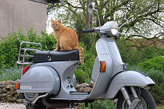

# The Wonderful World of Floats

So now that we have positioning in our toolkit, there is another essential CSS layout tool we need to add: floats.

## Images in a Magazine

An easy way to consider floats is to think about images in a magazine. I know, print is dead. Just roll with me on this one.

So let's pretend that we are laying out a page in a magazine, and we want to include an image. With everything we know thus far, we might do something like this:

```html
<html>
	<head>
		<link rel="stylesheet" href="style.css" />
	</head>
	<body>
		
		<p>Bacon ipsum dolor sit amet deserunt kevin rump, pork chop qui in commodo consequat eu. Pig hamburger flank shank, in enim shankle. In meatloaf salami, do tenderloin et in leberkas pastrami pork belly elit. Nisi chuck brisket anim.</p>

		<p>Brisket minim magna sunt fugiat deserunt ball tip. Ex tri-tip tenderloin, turducken biltong anim cow shankle swine nulla. Pork short ribs doner pariatur, et irure incididunt turducken spare ribs do excepteur ea swine. Tempor fugiat tail drumstick meatball, cupidatat bacon adipisicing biltong enim. Short ribs frankfurter labore enim pig sunt ribeye flank leberkas eu dolor ullamco. Eiusmod minim kevin nulla filet mignon t-bone.</p>

		<p>Boudin prosciutto culpa, leberkas in landjaeger occaecat cupidatat meatball irure. Salami velit strip steak, occaecat ad sirloin sed chicken. Ea tri-tip magna ut shankle consequat meatloaf laborum jerky voluptate. Porchetta et id qui venison sirloin short ribs sed non shank reprehenderit minim ut pastrami.</p>
	</body>
</html>
```

Which would produce this:


That's ok and all, but it doesn't look much like a magazine.

## Enter Floats

Using floats, we can make this look a lot better. In our stylesheet, let's add a new selector and a declaration:

```css
img {
	float: left;
}
```


Closer! All we did is add `float: left` to the `img` tag. This removes the image from the normal flow of the document and allows the text to wrap around it. But the text is all crunched up on the image on the right hand side. How do we fix that?

Well, if you remember last week, we can set a `margin-right` property to the our `img` selector to give it a little bit of space.

```css
img {
	float: left;
	margin-right: 10px;
}
```


Now we're cooking with fire. But our editor called up and hates the photo on the left. No problem, let's move it to the right. 

If we kept the HTML exactly the same and simply changed the CSS `float` property value to `right` and change `margin-right` to `margin-left`, we'd get this:


Remember, **we didn't touch anything in the structure of our HTML document**, all we did was change the CSS:

```css
img {
	float: right;
	margin-left: 10px;
}
```

Boomtown, U.S.A. That is the essence of floats. It removes the element from the natural flow of the document and allows other elements to wrap around it.